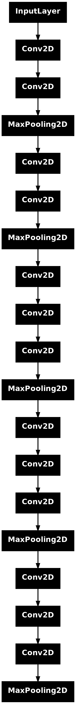
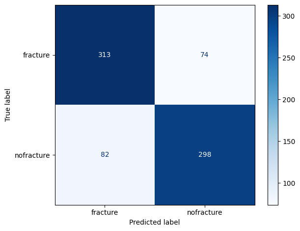
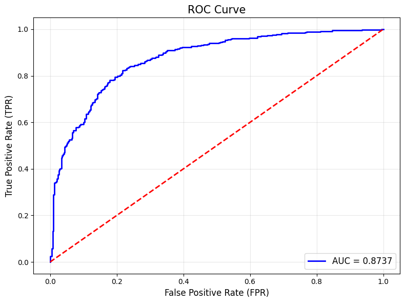

# <div align="center"> **OsteoAI** </div> 
## <div align="center"> *Automatic classification of X-ray images in bone fractures or non-fractures using Deep and Machine Learning* </div> 

⚠️ **This is a theoretical prototype. Not for medical use**


### **Project Structure**

``` markdown
OsteoAI/
├── App/
│    ├── app.py    ← Creates Streamlit app
│    ├── example_fracture.jpg
│    ├── example_nofracture.jpg
│    ├── lgbm.pkl  ← Model used for X-ray images classification (fracture vs non-fracture)
│    └── logo.png

├── data/
│   └── Processed/
│       └── ml-dp/  ← Structured folders for Deep Learning and Machine Learning models
│       │   ├── fracture/
│       │   └── nofracture/

├── Notebooks/
│   ├── 1-Create_directories.ipynb  ← Creates train/test/valid folders inside /ml-dp/
│   ├── 2-CNN_proofs.ipynb          ← Experiments with DL and ML models
│   └── 3-lgbm.proofs.ipynb         ← Experiments with Light Gradient-Boosting Model

├── Plots/

├── src/
│   ├── callback_training_CNN.py  ← Callbacks for CNN training
│   ├── copy_images.py            ← Copies images between directories
│   ├── creating.directories.py   ← Creates necessary directories
│   ├── extract_features.py       ← Extracts image features using CNN for ML model training
│   ├── image_loader.py           ← Loads and visualizes images
│   ├── image_preprocessor.py     ← Performs data augmentation and image normalization
│   ├── import_images.py          ← Creates datasets
│   └── metrics_CNN.py            ← Metrics for evaluating CNN performance (accuracy, loss, confusion matrix, AUC-ROC curve)

├── LICENSE

├── README.md

└── requirements.txt
```


### **App Usage Note**

You can find the **Streamlit app** in the next link https://osteoai.streamlit.app/.

The **Streamlit app** included in this project is optimized for use on **desktop or laptop devices**.
Mobile or tablet users may experience **layout issues** or reduced functionality due to resolution and compatibility limitations inherent to smaller screens.

To get the best experience:
- Use the latest version of Google Chrome or Mozilla Firefox.
- Ensure a stable internet connection for model loading and image uploads.
- Recommended screen resolution: 1280x720 or higher.

To launch the app locally:
``` python
cd App
streamlit run app.py
```


### **Abstract**

Fracture diagnosis is a critical yet error-prone task in emergency care, often affected by radiologist fatigue, limited experience, or subtle fracture presentations. This study introduces OsteoAI, a hybrid deep learning and machine learning framework for automatic binary classification of bone fractures in X-ray images. The approach integrates a pre-trained convolutional neural network (VGG16) for image feature extraction with a Light Gradient Boosting Machine (LightGBM) for classification. The model was trained and evaluated on a curated version of the Bone Fracture Detection: Computer Vision Project dataset from Kaggle, where data were cleaned, normalized, and restructured into two categories: fracture and non-fracture. Compared with end-to-end CNNs and other hybrid configurations, the VGG16 + LightGBM model achieved the best performance, with an accuracy of 79.7%, precision and recall scores of approximately 0.80, and an AUC of 0.87 on the test set. While effective, the model underperformed relative to recent state-of-the-art methods using architectures such as U-Net and ResNet-152, which achieved sensitivity and specificity above 0.94. Nevertheless, VGG16 demonstrated advantages in inference speed and resource efficiency, making it suitable for prototype or real-time support applications in resource-limited settings. Future work should explore improved preprocessing techniques and more advanced CNN architectures for deployment in clinical environments. Additionally, a Streamlit-based web interface was developed to demonstrate real-time model predictions and support clinical decision-making.

**Keywords**: Bone Fracture Detection, Computer-Aided Diagnosis, Convolutional Neural Networks, Deep Learning,  Medical Imaging, LightGBM, Transfer Learning, VGG16, X-ray Classification 


### **Introduction**

Fractures are among the most common reasons for emergency room visits (Tanzi et al., 2020). Statistics show that there are nearly three million bone fractures annually in France, Germany, Italy, Spain, Sweden, and the UK alone (Tanzi et al., 2020). The overall incidence is 11.67 per 1,000 inhabitants for men and 10.65 per 1,000 for women each year (Yang et al., 2020). Many patients suffer long-term consequences due to undiagnosed or untreated fractures (Tanzi et al., 2020). Therefore, early and accurate detection of bone fractures is critical.

Nonetheless, misdiagnoses by radiologists still occur, often due to a combination of factors such as fatigue from excessive workloads, emergency situations, night shifts (Hallas et al., 2006; Yang et al., 2020), the inherent limitations of human vision (Yang et al., 2020), lack of experience (Tanzi et al., 2020), or the subtle nature of certain fractures (Tanzi et al., 2020).

In recent years, artificial intelligence (AI) in medical image processing has attracted increasing attention (Su et al., 2023), particularly the application of deep learning (Su et al., 2023). The integration of deep learning with traditional diagnostic methods has given rise to a new field known as computational radiology (Meena & Roy, 2022). Deep learning not only enhances diagnostic accuracy but also helps reduce the workload of radiologists (Meena & Roy, 2022). Academic research has demonstrated that deep learning models can, in some cases, outperform human doctors in diagnostic tasks (Lindsey et al., 2018). Architectures such as ResNet, DenseNet, and EfficientNet have achieved high accuracy on benchmark datasets like MURA (Rajpurkar et al., 2017) and the RSNA Bone Fracture Detection dataset (https://www.kaggle.com/).

As a result, the number of studies exploring deep learning for fracture detection has steadily increased. Recent research has focused on detecting specific types of fractures or fractures in specific bones, such as wrist fractures (see Thian et al., 2019; Raisuddin et al., 2021; Joshi et al., 2022; Gan et al., 2024; Hasen et al., 2024), hip fractures (see Badgeley et al., 2019; Cheng et al., 2019; Krogue et al., 2020; Gao et al., 2023; Kim et al., 2024), or humerus fractures (see Chung et al., 2018; Kekatpure et al., 2024; Spek et al., 2024), among others.

OsteoAI is a machine learning and deep learning project focused on the automatic classification of bone fractures from medical images, specifically X-rays. The project combines classical machine learning techniques with convolutional neural networks (CNNs) to extract image features and classify radiographs as either fracture or non-fracture. Unlike other approaches, the integration of a CNN (in this case, VGG16) with a machine learning algorithm (LightGBM) offers several advantages: it can reduce training time and computational cost, minimize overfitting, facilitate fine-tuning, and improve interpretability—without compromising performance. OsteoAI aims to support radiologists and medical professionals by providing an automated fracture detection system based on deep convolutional networks.


### **Materials and Methods**

<p><strong>Data cleansing</strong></p>
Data were obtained in Kaggle (https://www.kaggle.com/), specifically from the dataset titled *Bone Fracture Detection: Computer Vision Project* (Darabi 2024). For this project, only the file *BoneFractureYolo8* was used. The original dataset included eight different classes: non-fractured bone, humerus, humerus fracture, elbow positive, fingers positive, forearm fracture, shoulder fractures, and wrist positive.

A data cleansing process was performed to remove low-quality images (e.g., overly dark or light). The dataset was then restructured into two categories: fracture (including all types of fractures from the original dataset) and non-fracture.

<p><strong>Fracture and non-fracture classification using CNNs</strong></p>
The initial approach was to use a *YOLO* (You Only Look Once) object detection model from *Ultralytics* for identifying fractures. However, due to high computational requirements and poor performance, a classification-based method using Convolutional Neural Networks (CNNs) was adopted instead.

All processing and modeling were done using Python 3.11.9 (Van Rossum & Drake, 2009). The primary libraries used included *TensorFlow* (Abadi et al., 2015), *Keras* (Chollet et al., 2015), *OpenCV* (Bradski, 2000), *Matplotlib* (Hunter, 2007), and *Scikit-learn* (Pedregosa et al., 2011).

<p><strong>Data Preprocessing</strong></p>
The dataset consisted of labeled X-ray images categorized into two classes: fracture and non-fracture. Prior to modeling, all images were rescaled and normalized. The dataset was split into training (64%), validation (16%), and testing (20%) subsets (see `1-Create_directories.ipynb` in the `Notebooks` folder).
<p></p>
<p><strong>CNN Architectures</strong></p>
The following CNN models were tested:
- <u>Custom CNNs</u>: Trained on images resized to 256×256 pixels.
- <u>VGG16</u>: Pre-trained on ImageNet, using 224×224 pixel input size (Simonyan & Zisserman 2014)
- <u>ResNet-50</u>: Pre-trained on ImageNet, also using 224×224 pixel inputs (He et al 2015)

For pre-trained CNNs, transfer learning and fine-tuning techniques were applied. This involved freezing/unfreezing selected layers and adding custom layers tailored to the new classification task. All CNN models were trained using the Adam optimizer. Training and validation performance were monitored using binary accuracy and loss function metrics.

To optimize training, two callbacks were implemented (see `callbacks_training_CNN.py` in the `src` folder):
- <u>ReduceLROnPlateau</u>: Automatically reduces the learning rate when validation loss plateaus.
- <u>EarlyStopping</u>: Halts training when the model fails to improve for a predefined number of epochs, helping to prevent overfitting.

<p><strong>Hybrid Deep Learning and Machine Learning Approach</strong></p>
Beyond end-to-end CNN training, a hybrid approach was explored. In this method, features were extracted from trained CNNs and used as input to machine learning classifiers. This was accomplished using a custom script (`extract_features.py` in the `src` folder), where the CNN was trained with the dataset but with the final classification layer removed to capture image features.

These features were then used to train four types of machine learning models:
- Random Forest
- Support Vector Classifier (SVC)
- XGBoost
- LightGBM

<p><strong>Evaluation Metrics</strong></p>
For CNN-based models, evaluation metrics were generated only when training and validation accuracy/loss indicated stable performance. For hybrid models, evaluation was conducted in all cases. The following evaluation metrics were used (see `metrics_CNN.py` in the `src` folder):

- Classification Report: Including precision, recall, F1-score per class, macro-average, and weighted-average.
- Confusion Matrix
- AUC-ROC Curve

<p><strong>Interactive Web Application</strong></p>
To facilitate user interaction and model deployment, a web-based application was developed using Streamlit (Streamlit Inc., 2020). The app allows users to upload X-ray images and receive predictions in real time using the trained VGG16 + LightGBM model. This improves accessibility for non-technical users such as radiologists or healthcare staff.


### **Results**

No single network had really good results (see `2-CNN_proofs.ipynb` in the `Notebooks`folder). The hybrid models had a better performance (see `2-CNN_proofs.ipynb` in the `Notebooks`folder). The best model was the combination of the VGG16 (Fig. 1) used to extract image features and the Light Gradient-Boosting Model for classification (see `lgbm_proofs.ipybn` in the `Notebooks` folder).

<p align="center">
  
</p>
<p align="center">
<strong>Figure 1.</strong>VGG16 structure.
</p>

The final evaluation of the model was conducted on the test dataset, yielding an overall accuracy of 79.7% (Table 1). As shown in the confusion matrix (Fig. 2), the model correctly classified 313 fracture cases and 298 non-fracture cases, while misclassifying 74 and 82 instances, respectively. The classification report indicated balanced performance across both classes (Table 1). For the non-fracture class (label 1), the model achieved a precision of 0.79, recall of 0.81, and F1-score of 0.80. For the fracture class (label 0), the values were 0.80, 0.78, and 0.79, respectively. The macro and weighted averages for precision, recall, and F1-score were all 0.80, demonstrating consistent predictive capability across classes. Additionally, the model achieved an area under the ROC curve (AUC) of 0.8737 (Fig. 3). 

**Table 1**. Classification report obatined with te predictions of test dataset using the model VGG16 + LightGBM.
**Accuracy on test set:** 0.7966
| **Class**              | **Precision** | **Recall** | **F1-Score** | **Support** |
|------------------------|---------------|------------|--------------|-------------|
| 0.0 (Fracture)         |     0.79      |    0.81    |     0.80     |     387     |
| 1.0 (Non-fracture)     |     0.80      |    0.78    |     0.79     |     380     |
| Accuracy               |               |            |     0.80     |     767     |
| Macro Avg              |     0.80      |    0.80    |     0.80     |     767     |
| Weighted Avg           |     0.80      |    0.80    |     0.80     |     767     |


<p align="center">
  
</p>
<p align="center">
<strong>Figure 2.</strong> Confusion matrix for the VGG16 + LightGB hybrid model.
</p>


<p align="center">
  
</p>
<p align="center">
<strong>Figure 3.</strong> ROC-AUC curve for the VGG16 + LightGB hybrid model.
</p>


### **Discussion and conclusions**

The VGG16 + LightGBM hybrid model proved moderately effective in distinguishing between fracture and non-fracture cases, although it exhibited a slight tendency to misclassify non-fracture cases as fractures. Despite its solid performance, the model did not reach the high metrics reported in other studies. For instance, Dimililer (2017) achieved a precision of 91.4% in binary classification. While the specific CNN architecture was not disclosed, the study applied Haar Wavelet transforms and the SIFT algorithm for feature extraction, training the model with only 30 images.

Similarly, Lindsey et al. (2018) developed a wrist fracture detection model achieving 0.94 sensitivity and 0.95 specificity using a U-Net architecture. Unlike VGG16, U-Net performs semantic segmentation by classifying each pixel rather than entire images. This enables it to generate fracture probability maps localized within the image. As a result, U-Net has become widely used in medical imaging tasks (Ronneberger et al., 2015). However, VGG16 offers faster inference times, which can be advantageous for deployment in resource-constrained environments like the one considered in this project.

Chung et al. (2018) reported excellent results using ResNet-152 to classify humerus fractures, reaching a sensitivity of 0.99 and a specificity of 0.97. Meanwhile, Olczak et al. (2017) performed a multiclass classification on X-ray images using several architectures (BVLC CaffeNet, VGG8, VGG16, and VGG19), with VGG16 yielding the best accuracy at 0.83.

Given these comparisons, while VGG16 can deliver competitive results, it may not match the performance of more specialized architectures like U-Net or deeper networks like ResNet when it comes to extracting complex image features. This highlights the inherent trade-off between model accuracy and inference speed.

The choice of model architecture should therefore align with the intended application. If the goal is to fully replace radiologists, high-performing architectures with advanced preprocessing techniques (e.g., SIFT or Haar) would be necessary. However, for clinical decision support, prioritizing models with lower computational demands and faster inference, such as VGG16, may be more appropriate.

In this project, the goal was to develop a prototype support tool rather than a production-ready diagnostic system. Under this context, the chosen model proved sufficiently robust. However, if the project were to be commercialized, future work should focus on improving image preprocessing, using more homogeneous datasets (e.g., fracture detection in a specific bone), and potentially exploring more advanced CNN architectures such as U-Net or deeper ResNet.


### **References**

1. Abadi M, Agarwal A, Barham P, Brevdo E, Chen Z, ..., Zheng X. (2015). TensorFlow: Large-scale machine learning on heterogeneous systems. Software available from tensorflow. org
2. Badgeley MA, Zech JR, Oakden-Rayner L, Glicksberg B, Liu M, Gale W, ..., Dudley JT. (2019). Deep learning predicts hip fracture using confounding patient and healthcare variables. *NPJ digital medicine* 2(1): 31. https://doi.org/10.1038/s41746-019-0105-1
3. Bradski, G. (2000). The OpenCV Library. *Dr. Dobb's Journal of Software Tools*.
4. Cheng CT, Ho TY, Lee TY, Chang CC, Chou CC, Chen CC, ..., Liao CH. (2019). Application of a deep learning algorithm for detection and visualization of hip fractures on plain pelvic radiographs. *Europian Radiolpgy* 29: 5469–5477. https://doi.org/10.1007/s00330-019-06167-y
5. Chollet, F., & others. (2015). Keras. https://keras.io
6. Chung SW, Han SS, Lee JW, Oh KS, Kim NR, Yoon JP, ..., Kim Y. (2018).Automated detection and classification of the proximal humerus fracture by using deep learning algorithm. *Acta Orthopaedica* 89(4), 468–473. https://doi.org/10.1080/17453674.2018.1453714
7. Darabi PK. (2024). Bone Fracture Detection: A Computer Vision Project. DOI: 10.13140/RG.2.2 14400.34569
8. Dimililer K. (2017). IBFDS: Intelligent bone fracture detection system. *Procedia computer science* 120: 260-267.
9. Gan K, Liu Y, Zhang T, Xu D, Lian L, Luo Z, ..., Lu L. (2024). Deep Learning Model for Automatic Identification and Classification of Distal Radius Fracture. *Journal of Imaging Informatics in Medicine*: 37(6): 2874-2882. doi: 10.1007/s10278-024-01144-4.
10. Gao Y, Soh NYT, Liu N, Lim G, Ting D, Cheng LTE, ..., Yan YY. (2023). Application of a deep learning algorithm in the detection of hip fractures. *Iscience*: 26(8): 107350
11. Hallas P, Ellingsen T. (2006) Errors in fracture diagnoses in the emergency department – characteristics of patients and diurnal variation. *BMC emergency medicine* 6: 1-5. https://doi.org/10.1186/1471-227X-6-4
12. Hansen V, Jensen J, Kusk MW, Gerke O, Tromborg HB, Lysdahlgaard S. (2024). Deep learning performance compared to healthcare experts in detecting wrist fractures from radiographs: A systematic review and meta-analysis. *European Journal of Radiology* 174: 111399. https://doi.org/10.1016/j.ejrad.2024.111399.
13. Harris CR, Millman KJ, Van der Walt SJ, Gommers R, Virtanen P, Cournapeau D, ..., Oliphant T. (2020). Array programming with NumPy. *Nature* 585: 357–362. DOI: 10.1038/s41586-020-2649-2. 
14. He K, Zhang X, Ren S, Sun J. (2015). Deep Residual Learning for Image Recognition. *arXiv*. https://doi.org/10.48550/arXiv.1512.03385
15. Hunter JD. (2007). Matplotlib: A 2D Graphics ENvironment. Computing in Science & Engineering 9(3): 90–95 Van Rossum G, Drake FL. (2009). Python 3 Reference Manual. Scotts Valley, CA: CreateSpace
16. Joshi D, Singh TP, Joshi AK. (2022). Deep learning-based localization and segmentation of wrist fractures on X-ray radiographs. *Neural Computing and Applications* 34: 19061–19077. https://doi.org/10.1007/s00521-022-07510-z
17. Kekatpure A, Kekatpure A, Deshpande S, Srivastava S. (2024). Development of a diagnostic support system for distal humerus fracture using artificial intelligence. *International Orthopaedics (SICOT)* 48: 1303–1311. https://doi.org/10.1007/s00264-024-06125-4
18. Kim Y , Kim YG, Park JW, Kim BW, Shin Y, Kong SH, ..., Shin CS. (2024). A CT-based Deep Learning Model for Predicting Subsequent Fracture Risk in Patients with Hip Fracture. *Radiology* 310: 1
19. Krogue JD, Cheng KV, Hwang KM, Toogood P, Meinberg EG, Geiger EJ, ..., Pedoia V. (2020 )Automatic Hip Fracture Identification and Functional Subclassification with Deep Learning. *Radiology: Artificial Intelligence* 2(2): e190023.
20. Lindsey R, Daluiski A, Chopra S, Lachapelle A, Mozer M, ..., Potter H. (2018). Deep neural network improves fracture detection by clinicians. *Proceedings of the National Academy of Sciences* 115(45): 11591–11596. https://doi.org/10.1073/pnas.1806905115
21. Meena T, Roy S. (2022). Bone Fracture Detection Using Deep Supervised Learning from Radiological Images: A Paradigm Shift. *Diagnosis* 12(10): 2420. https://doi.org/10.3390/diagnostics12102420
22. Olczak J, Fahlberg N, Maki A, Razavian AS, Jilert A, Stark A, ..., Gordon M. (2017). Artificial intelligence for analyzing orthopedic trauma radiographs: deep learning algorithms—are they on par with humans for diagnosing fractures?. *Acta orthopaedica* 88(6): 581-586.
23. Pedregosa F, Varoquaux G, Gramfort A, Michel V, Thirion B, ..., Duchesnay E. (2011). Scikit-learn: Machine Learning in Python. *Journal of Machine Learning Research* 12:
2825-2830
24. Rajpurkar P, Irvin J, Bagul A, Ding D, Duan T, Mehta H, ..., Ng AY. (2017). MURA: Large dataset for abnormality detection in musculoskeletal radiographs. *arXiv:1712.06957*. https://arxiv.org/abs/1712.06957. https://doi.org/10.48550/arXiv.1712.06957
25. Raisuddin AM, Vaattovaara E, Nevalainen M, Nikki M, Järvenpää E, Makkonen K, ..., Tiulpin A. (2021). Critical evaluation of deep neural networks for wrist fracture detection. *Scintific Reports* 11: 6006. https://doi.org/10.1038/s41598-021-85570-2
26. Ronneberger O, Fischer P, Brox T. (2015). U-net: Convolutional networks for biomedical image segmentation. In *Medical image computing and computer-assisted intervention–MICCAI 2015: 18th international conference, Munich, Germany, October 5-9, 2015, proceedings, part III 18* (pp. 234-241). Springer international publishing.
27. Simonyan K, Zisserman A. (2014). Very Deep Convuntional Networks for Large-Scale Image Recognition. *arXiv*. https://doi.org/10.48550/arXiv.1409.1556
28. Spek RWA, Smith WJ, Sverdlov M, Broos S, Zhao Y, Liao Z, ..., Doornberg JN. (2024). Detection, classification, and characterization of proximal humerus fractures on plain radiographs. *The Bone & Joint Journal*, 106-B(11), 1348-1360. https://doi.org/10.1302/0301-620X.106B11.BJJ-2024-0264.R1
29. Streamlit Inc. (2020). *Streamlit: A faster way to build and share data apps*. https://streamlit.io
30. Su Z, Adam A, Nasrudin MF, Ayob M, Punganan G. (2023). Skeletal fracture detection with deep learning: A comprehensive review. *Diagnostics* 13(20): 3245. https://doi.org/10.3390/diagnostics13203245
31. Tanzi L, Vezzetti E, Moreno R, Moos S. (2020). X-Ray Bone Fracture Classification Using Deep Learning: A Baseline for Designing a Reliable Approach. *Applied Science* 10(4): 1507. https://doi.org/10.3390/app10041507
32. Thian YL, Li Y, Jagmohan P, Sia D, Chang, VEY, Tan RT. (2019). Convolutional Neural Networks for Automated Fracture Detection and Localization on Wrist Radiographs. *Radiology: Artificial Intelligence* 1(1): e180001.
33. Wang A, Chen H, Liu L, Chen K, Lin Z, Han J, Ding G. (2024). YOLOv10: Real-Time End-to-End Object Detection. DOI: 10.48550/arXiv.2405.14458
34. Yang S, Yin B, Feng C, Fan G, He S (2020). Diagnostic accuracy of deep learning in orthopaedic fractures: a systematic review and meta-analysis. *Clincal Radiology* 75(9): 713-728. https://doi.org/10.1016/j.crad.2020.05.021


### **Aknowledgements**

This project has been develop under Nodd3r program R2DS. I want to thank Christian Donaire (Nodd3r) for his supervision and support in this project, solving all my doubts and helping me in moments of blockage. Likewise, to my co-workers Andrés Baamonde and Jesús Campo, who have always found time to help me in this project and to solve problems more related to programming. On a personal level, to my partner Fer Cortés-Fossati for giving me emotional support throughout this master's degree and this project at times when I wanted to give it all up. And of course to my cats Mia, Kleo and Maki who, with their contagious joy, make everything more bearable.


### **License**

This project is licensed under the [MIT License](./LICENSE).


### **Author**

**Irene Martín Rodríguez**  
GitHub: [@irene-martin-rod](https://github.com/irene-martin-rod)

LinkedIn: [Irene Martín Rodríguez](www.linkedin.com/in/irenemartin-rodriguez)

Email: martinrod.irene@gmail.com
